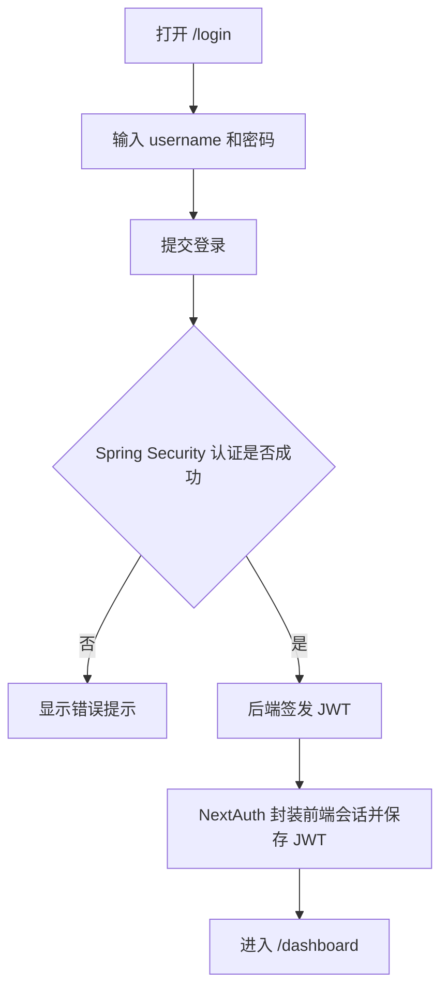
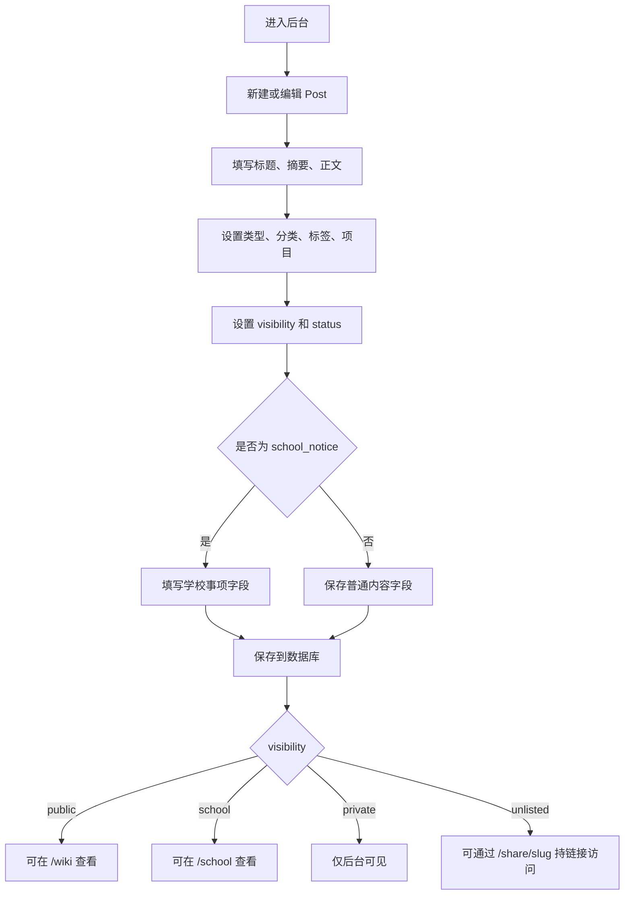
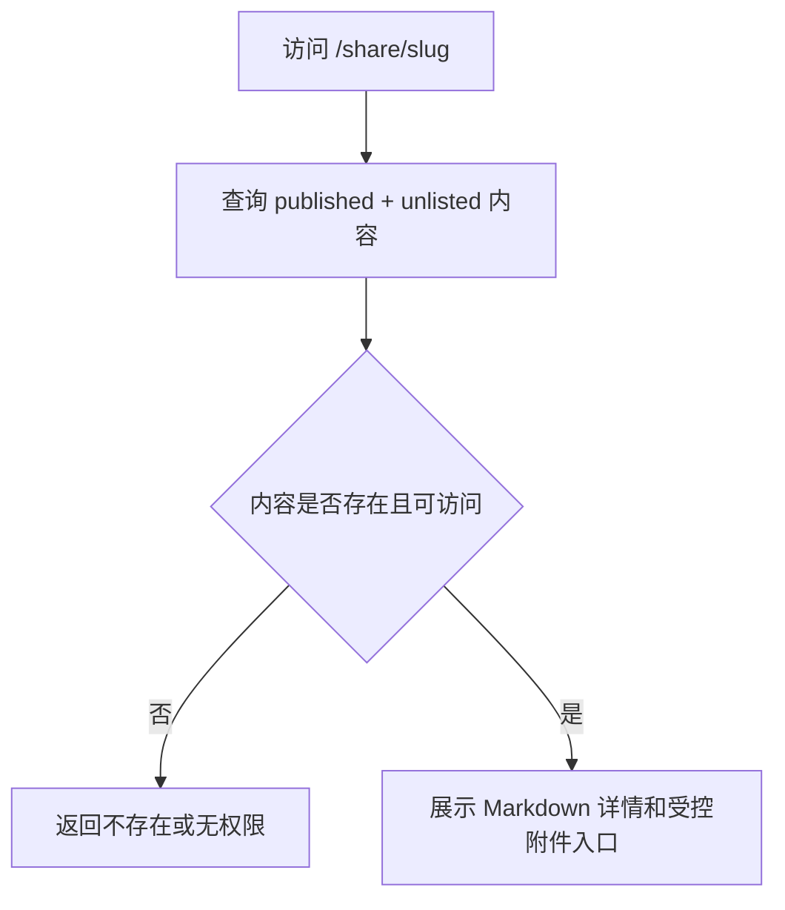
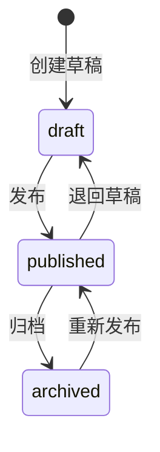
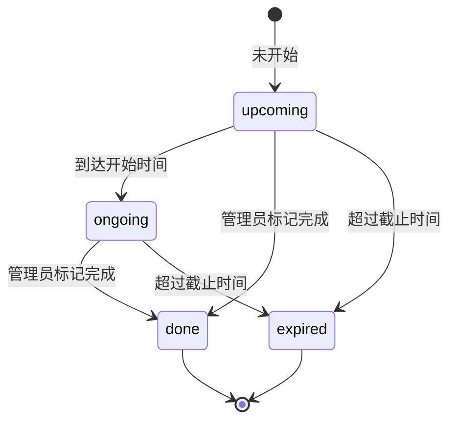
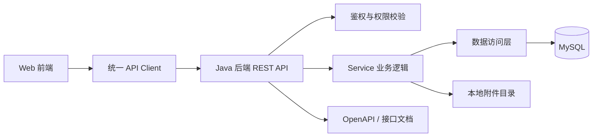

# NYC-TekFlow 个人知识工作台 PRD

**文档信息**

| 项目 | 内容 |
|---|---|
| 产品名称 | TekFlow / TekFlow 个人知识工作台 |
| 项目主题 | 面向个人使用的技术知识、运维手册、学校事项和项目记录工作台 |
| 文档版本 | v1.4 |
| 文档状态 | V1.0.0 第一阶段需求已确认 |
| 适用阶段 | 个人全栈项目 / 小型全栈演示项目 |
| 技术方向 | Next.js 16 + React 19 + Java 21.0.4 + Spring Boot 3.5.x + Spring Security + Spring AOP + MyBatis-Plus + MySQL 8.0.45 |
| 当前主视觉 | `docs/design/DESIGN.md` |
| 默认运行地址 | 待工程创建后确认 |
| 最近更新 | 2026-06-18 |

**版本记录**

| 版本 | 日期 | 说明 |
|---|---|---|
| v1.0 | 2026-06-18 | 初始化 PRD，明确 TekFlow V1.0.0 的项目目标、功能范围、数据对象和验收标准 |
| v1.1 | 2026-06-18 | 清理外部项目引用，调整技术栈说明为 TekFlow 自身选型讨论稿 |
| v1.2 | 2026-06-18 | 定稿前后端技术栈、RESTful API 风格、认证边界和数据库版本 |
| v1.3 | 2026-06-18 | 根据需求审查结果补齐 V1.0.0 范围、访问策略、unlisted 路由、附件权限、认证桥接、分页结构、发布校验、上传限制、数据库脚本和测试交付规则 |
| v1.4 | 2026-06-18 | 将后端鉴权从 Sa-Token 调整为 Spring Security + JWT，并补充 Spring AOP 在日志、审计、权限辅助和性能监控中的项目作用 |

**参考来源**

| 来源 | 借鉴点 |
|---|---|
| TekFlow V1.0.0 产品实现摘要 | 产品定位、模块范围、数据对象、状态和可见性规则 |
| `AGENTS.md` | 项目协作规则、已确认技术栈和安全边界 |
| `docs/design/DESIGN.md` | UI 设计方向、页面风格映射、响应式和暗色模式边界 |

**术语说明**

| 术语 | 说明 |
|---|---|
| Post | TekFlow 的核心内容对象，覆盖技术笔记、运维手册、学习资料、项目记录、SOP、复盘、教程和学校通知 |
| Visibility | 内容可见性，V1.0.0 支持 `private`、`public`、`school`、`unlisted` |
| School Notice | 带课程、时间、地点、截止时间、优先级和状态字段的学校通知/事项内容 |
| Unlisted | 持链接访问内容，不进入 `/wiki` 或 `/school` 列表，通过 `/share/[slug]` 访问 |
| Project | 项目标签，不是完整项目管理模块，只用于归类内容 |
| Attachment | 关联到 Post 的附件元数据，文件本体保存到服务端本地目录，下载统一经过受控接口鉴权 |

## 1. 项目背景

用户日常同时处理公司项目、网站需求与 Bug、企业 IT 架构、NAS 权限、服务器运维、Cloudflare、PM2、Git、Google API、学校课程、考试、作业、小组任务和个人技术沉淀等信息。

这些信息目前分散在聊天记录、截图、文档、备忘录、NAS、Git 仓库和临时文件中，存在以下问题：

- 出门在外时资料难以统一检索。
- 技术沉淀难以沉淀成可公开展示的作品。
- 学校通知、作业、考试和截止时间缺少统一面板。
- 公司内部敏感内容和公开知识内容边界不清晰。
- 项目记录、运维手册、学习资料缺少统一分类、标签和附件关联。

TekFlow V1.0.0 先解决个人高频使用场景，聚焦知识库和通知系统，不做复杂项目管理，也不做 AI 方案生成器。

## 2. 项目目标

本项目要解决个人用户在技术沉淀、学校事项和项目资料管理中的统一记录、检索、发布和权限边界问题。

项目目标包括：

- 管理员可以登录后台并维护 Markdown 内容。
- 内容可以按分类、标签、项目标签、类型、状态和可见性组织。
- public 内容可以发布到公开知识库 `/wiki`。
- school 内容可以发布到学校事项板 `/school`，并突出时间、截止日期和状态。
- private 内容只能由管理员在后台查看。
- 附件可以关联到内容，并跟随内容权限访问。
- V1.0.0 形成真实数据闭环，避免只做静态页面或 mock 演示。

第一阶段成功标准：

- 管理员能登录后台并新建一篇内容。
- 内容能设置 `private`、`public`、`school` 或 `unlisted`。
- `public + published` 内容能在 `/wiki` 查看。
- `school + published` 内容能被游客在 `/school` 按时间紧急程度查看。
- `unlisted + published` 内容能通过 `/share/[slug]` 持链接访问，但不出现在公开列表。
- `private` 内容不会出现在公开页面。
- 附件不会绕过 Post 权限被公开访问。

## 3. 项目定位

TekFlow 定位为个人知识工作台和小型全栈项目，不是正式商业级协作平台。

| 维度 | 说明 |
|---|---|
| 项目类型 | Web 前端 + Java 后端 + MySQL + 本地附件存储 |
| 复杂度 | 中等，优先保证个人可用、可运行、可讲解 |
| 核心亮点 | Markdown 内容管理、可见性边界、公开 wiki、学校事项板、附件权限 |
| 设计方向 | 面向知识工作台，界面应清晰、克制、适合长期使用 |
| 实现原则 | 先跑通最小闭环，不引入过度工程化能力 |

第一阶段范围边界：

| 做 | 不做 |
|---|---|
| 管理员后台、登录、内容增删改查 | 多人协作、团队空间、复杂组织权限 |
| Markdown 内容、分类、标签、项目标签 | 完整任务看板、甘特图、审批流 |
| `/` 简单入口页 | 营销式大型官网或复杂品牌站 |
| `/wiki` 公开知识库 | 评论系统、点赞收藏、社区互动 |
| `/school` 学校事项板 | 同学提交作业、在线考试、答案库 |
| `/share/[slug]` 持链接访问 unlisted 内容 | 复杂分享权限、访问码、过期分享链接 |
| 附件上传和权限跟随 Post | 对象存储、CDN、静态公开附件路径、自动 OCR |
| 搜索与筛选 | 向量数据库、聊天记录自动导入 |
| 基础安全和脱敏规则 | AI 自动生成、自动脱敏、复杂工作流自动化 |
| 浅色主题和移动端基础可用 | V1.0.0 暗色模式、移动端后台完整等价体验 |

## 4. 用户角色

| 角色 | 主要目标 | 第一阶段权限 |
|---|---|---|
| 管理员 | 维护全部知识、通知、附件和公开内容 | 登录后台，创建、查看、编辑、删除、发布全部内容 |
| 游客 | 查看公开知识内容 | 访问 `/wiki` 和 public published 内容 |
| 学校内容访问者 | 查看 school published 通知和学习事项 | 游客身份访问 `/school` 和 school published 内容，不允许访问 private 内容 |
| 链接访问者 | 通过已知链接查看 unlisted 内容 | 访问 `/share/[slug]` 的 unlisted published 内容，不进入公开列表 |

V1.0.0 第一版只有管理员账号是必需项。用户表允许后续扩展多个管理员，但第一阶段不做管理员管理页面。同学用户体系暂缓；如果后续实现同学登录，只能查看符合 school 权限的 published 内容。

用户画像：

| 用户 | 场景 | 目标 |
|---|---|---|
| 个人管理员 | 记录技术经验、运维 SOP、学校通知、项目复盘 | 统一写入、分类、检索和发布 |
| 外部访客 | 浏览公开技术文章和方法论 | 查看脱敏后的 public 内容 |
| 学校内容访问者 | 查看课程通知、作业截止、考试安排 | 按时间紧急程度查看 school 内容 |
| 链接访问者 | 从私下分享链接打开内容 | 查看不进入公开列表的 unlisted 内容 |
| 答辩/演示观看者 | 验证项目是否形成完整闭环 | 观察后台写入、前台展示、权限过滤和附件访问 |

## 5. 用户痛点

个人管理员痛点：

- 笔记和附件分散，查找成本高。
- 技术沉淀没有统一公开展示出口。
- 私有内容和公开内容容易混在一起。
- 学校截止时间、考试安排和课程通知容易遗漏。

游客痛点：

- 只能从零散链接里看单篇内容，缺少结构化知识库。
- 公开文章如果缺少脱敏规则，容易混入敏感内容。

学校内容访问者痛点：

- 按发布时间排序无法反映通知紧急程度。
- 作业、考试、地点、时间、截止日期等信息经常需要在多个渠道查找。

流程参考：

| 对标点 | 常见体验 / 传统流程 | 本项目第一阶段策略 |
|---|---|---|
| 技术文章沉淀 | 写在本地文件、聊天记录或临时文档中 | 统一写入 Post，public 内容进入 `/wiki` |
| 学校通知记录 | 截图、群聊、备忘录分散 | School Notice 结构化记录时间、课程、地点、截止日期 |
| 私有与公开边界 | 靠人工记忆判断是否能公开 | 每篇内容必须设置 visibility，公开页面按服务端规则过滤 |
| 附件管理 | 文件和正文分离，权限不可控 | Attachment 关联 Post，访问权限跟随 Post |

## 6. 核心功能范围

### 6.1 管理员后台功能

| 编号 | 功能 | 优先级 | 说明 |
|---|---|---|---|
| FR-ADM-001 | 管理员登录 | P0 | 管理员通过 `/login` 登录，成功后进入 `/dashboard` |
| FR-ADM-002 | 内容列表 | P0 | 查看全部 draft/published/archived 和全部 visibility 内容 |
| FR-ADM-003 | 新建和编辑内容 | P0 | 支持标题、自动生成且可编辑的 slug、摘要、Markdown 正文、编辑预览、类型、状态、可见性 |
| FR-ADM-004 | 分类管理 | P1 | 新增、编辑、删除分类，用于内容归类 |
| FR-ADM-005 | 标签管理 | P1 | 新增、编辑、删除标签，支持一篇内容多个标签 |
| FR-ADM-006 | 项目标签管理 | P1 | 维护项目标签，V1.0.0 不扩展为项目中台 |
| FR-ADM-007 | School Notice 管理 | P0 | `type = school_notice` 必须绑定 `visibility = school`，维护学校事项字段和 done 标记 |
| FR-ADM-008 | 附件管理 | P1 | 上传附件、关联 Post、查看附件元数据，下载统一走受控接口 |
| FR-ADM-009 | 内容搜索与筛选 | P1 | 关键词搜索标题、摘要、正文；按类型、可见性、状态、分类、标签、项目筛选 |
| FR-ADM-010 | 基础设置页 | P1 | `/dashboard/settings` 展示账号信息、系统配置摘要、上传限制和安全提示，不做复杂可写配置 |

### 6.2 公开知识库功能

| 编号 | 功能 | 优先级 | 说明 |
|---|---|---|---|
| FR-WIKI-001 | 公开知识库列表 | P0 | `/wiki` 只展示 `visibility = public` 且 `status = published` 的内容 |
| FR-WIKI-002 | 公开文章详情 | P0 | `/wiki/[slug]` 展示标题、摘要、正文、分类、标签、项目标签、发布时间、更新时间、附件 |
| FR-WIKI-003 | 公开内容脱敏提示 | P1 | 发布 public 内容前提醒不得包含敏感信息 |
| FR-WIKI-004 | 公开搜索筛选 | P1 | 支持按关键词、分类、标签、项目标签检索 public 内容 |

### 6.3 链接访问功能

| 编号 | 功能 | 优先级 | 说明 |
|---|---|---|---|
| FR-SHARE-001 | unlisted 详情页 | P0 | `/share/[slug]` 展示 `visibility = unlisted` 且 `status = published` 的内容 |
| FR-SHARE-002 | unlisted 列表排除 | P0 | unlisted 内容不出现在 `/wiki`、`/school` 或首页公开列表中 |
| FR-SHARE-003 | unlisted 附件访问 | P0 | unlisted 附件跟随 Post，通过受控附件接口校验后访问 |

### 6.4 学校事项板功能

| 编号 | 功能 | 优先级 | 说明 |
|---|---|---|---|
| FR-SCH-001 | School 首页 | P0 | `/school` 面向游客展示 school published 内容，按即将截止、今日事项、本周事项、已过期分区去重展示，并提供全部通知视图 |
| FR-SCH-002 | School Notice 详情 | P0 | `/school/[slug]` 展示课程、老师、日期、时间、截止日期、地点、优先级、状态、正文、附件 |
| FR-SCH-003 | 学校事项排序 | P0 | 未过期 urgent 且截止时间最近优先，其次今日事项、本周事项、已过期；状态由后端自动计算，done 可由管理员手动标记 |
| FR-SCH-004 | School 筛选 | P1 | 支持按课程、状态、优先级、日期范围筛选 |

### 6.5 通用功能

| 编号 | 功能 | 优先级 | 说明 |
|---|---|---|---|
| FR-AUTH-001 | 统一登录入口 | P0 | 管理员使用 username/password 登录，后端 Spring Security 校验身份并签发 JWT，前端 NextAuth 封装会话 |
| FR-SYS-001 | 统一响应结构 | P0 | API 返回 `{ code, msg, data }`，成功使用 HTTP 200 + `code = 200`，失败同时使用合适 HTTP 状态和业务 code |
| FR-SYS-002 | 权限过滤 | P0 | 后端按登录态、status、visibility 过滤内容和附件 |
| FR-SYS-003 | Markdown 渲染 | P0 | 正文使用 Markdown 编辑和展示 |
| FR-SYS-004 | 文档和演示支持 | P1 | 提供 OpenAPI/Swagger、`docs/API.md` 摘要、`docs/schema.sql` 和 `docs/seed-demo.sql` 最小演示 seed |

产品原则：

- 主流程必须使用真实后端和 MySQL，mock data 只能作为 UI 预览或离线兜底。
- 每篇内容必须有明确 visibility。
- 公开页面不能展示 private 内容。
- `/school` 面向游客访问，但只能展示 school published 内容。
- `/share/[slug]` 只能展示 unlisted published 内容。
- 附件权限必须跟随所属 Post，不能通过静态公开路径绕过受控接口。
- 客户端不得依赖中文 `msg` 判断业务逻辑。
- V1.0.0 功能边界必须清楚，不做过度扩展。

### 6.6 用户故事与验收标准

| 编号 | 用户故事 | 验收标准 |
|---|---|---|
| US-001 | 作为管理员，我希望登录后台创建 Markdown 内容，以便统一沉淀技术和学习资料 | 登录成功后可以创建内容，内容写入 MySQL 并在后台列表可见 |
| US-002 | 作为管理员，我希望为内容设置 visibility，以便区分私有、公开、学校和链接访问内容 | 同一篇内容改为 public/school/private 后，前台展示范围按规则变化 |
| US-003 | 作为游客，我希望查看公开知识库，以便阅读脱敏后的技术经验 | `/wiki` 只显示 public + published 内容，不显示 private/school/draft |
| US-004 | 作为学校内容访问者，我希望按截止时间查看事项，以便优先处理紧急内容 | `/school` 能显示即将截止、今日、本周、已过期分区 |
| US-005 | 作为管理员，我希望上传附件并关联内容，以便保存截图、PDF、Word、Excel 等资料 | 附件元数据写入数据库，访问权限跟随 Post |
| US-006 | 作为链接访问者，我希望通过私下分享链接查看内容，以便访问不公开列出的资料 | `/share/[slug]` 能打开 unlisted published 内容，且该内容不出现在 `/wiki` 或 `/school` |
| US-007 | 作为演示者，我希望用一组演示数据跑通闭环，以便证明系统不是静态 mock | 后台创建 public/school/private/unlisted 四类内容后，公开页面展示和权限过滤正确 |

## 7. 第一阶段功能

第一阶段实现内容：

- 管理员登录和后台入口。
- Post 内容模型和 Markdown 编辑。
- visibility 权限控制。
- `/` 简单入口页。
- `/wiki` 公开知识库列表与详情。
- `/school` 学校事项板列表与详情。
- `/share/[slug]` unlisted 持链接访问详情。
- School Notice 时间字段。
- 分类、标签、项目标签。
- 附件上传和访问控制。
- 搜索与筛选。

第一阶段必须补齐的接口、数据、页面能力：

- 登录接口和当前用户接口。
- Post CRUD、发布状态和可见性更新。
- public 内容列表和详情查询。
- school 内容列表、详情和时间分区查询。
- unlisted 详情查询。
- 分类、标签、项目标签基础 CRUD。
- 附件上传、元数据查询和受保护下载。
- OpenAPI/Swagger 接口文档入口、`docs/API.md` 接口摘要、`docs/schema.sql` 和 `docs/seed-demo.sql`。

功能需求明细：

| 编号 | 输入 | 输出 | 前置条件 | 异常情况 |
|---|---|---|---|---|
| FR-AUTH-001 | username、密码 | JWT 登录凭证、过期时间、NextAuth 会话、用户信息 | 管理员账号存在且启用 | 密码错误、账号禁用、未授权 |
| FR-ADM-003 | 标题、slug、正文、类型、状态、可见性、分类、标签、项目 | Post 详情 | 管理员已登录；slug 可自动生成并可编辑 | slug 重复、字段不合法、发布校验失败、权限失效 |
| FR-WIKI-001 | 搜索词、分类、标签、项目、分页 | `data={items,total,page,pageSize}` | 内容已发布且 public | 无数据、查询失败 |
| FR-SHARE-001 | slug | unlisted Post 详情 | 内容已发布且 unlisted | 不存在、未发布、非 unlisted |
| FR-SCH-001 | 日期范围、课程、状态、优先级、分页 | school 分区列表或全部通知分页 | 内容已发布、school 且 type 为 school_notice | 无数据、状态计算失败 |
| FR-SYS-002 | 登录态、Post 可见性、附件请求 | 允许或拒绝访问 | Post 存在 | 越权、Post 不存在、附件不存在 |

发布校验规则：

| 场景 | 必填和校验 |
|---|---|
| 创建草稿 | 普通 Post 至少需要标题、slug、类型、状态、可见性；slug 可由标题自动生成后由管理员修改 |
| 发布 public | 需要标题、slug、类型、状态、可见性和非空正文；发布前显示人工脱敏提醒 |
| 发布 unlisted | 需要标题、slug、类型、状态、可见性和非空正文；发布后通过 `/share/[slug]` 访问 |
| 发布 school | `type` 必须为 `school_notice`，`visibility` 必须为 `school`，event_date 或 deadline_at 至少一个存在，notice_priority 必填 |
| 发布 private | 使用基础字段校验，允许正文较轻量，便于个人草稿和内部记录 |

## 8. 后续扩展功能

| 阶段 | 功能 | 说明 |
|---|---|---|
| V1.1.0 | 项目中台 A | 项目、任务、状态、负责人、优先级、截止时间、验收标准、决策记录、今日作战面板 |
| V1.2.0 | 方案生成器 D | Bug 单、需求说明、SOP、汇报、问题清单、学习计划模板；第一版可先做模板 |
| V1.3.0 | 项目自动摘要 | 项目当前状态、最近进展、当前卡点、下一步建议、每周复盘 |

后续扩展必须先更新 PRD 和相关文档，不能直接在 V1.0.0 中混入。

## 9. 页面清单

| 页面名称 | 使用角色 | 页面目的 | 核心内容 | 第一阶段实现 | 关键状态 |
|---|---|---|---|---|---|
| `/` 首页 | 游客 / 学校内容访问者 / 管理员 | 提供 TekFlow 入口 | 简介、`/wiki`、`/school`、`/login`、最新公开内容 | 是 | 无公开内容、加载失败 |
| `/login` 登录页 | 管理员 | 登录后台 | username、密码、登录按钮 | 是 | 空输入、密码错误、登录中 |
| `/dashboard` 后台首页 | 管理员 | 查看内容概览和入口 | 内容数量、快捷入口、最近更新 | 是 | 加载中、失败、空数据 |
| `/dashboard/posts` 内容管理 | 管理员 | 管理全部内容 | 列表、筛选、搜索、状态、可见性 | 是 | 无内容、筛选无结果 |
| `/dashboard/posts/new` 新建内容 | 管理员 | 创建普通内容 | 标题、slug、摘要、正文、分类、标签、项目、visibility、status | 是 | 草稿、发布、校验失败 |
| `/dashboard/posts/[id]` 编辑内容 | 管理员 | 修改内容 | Post 表单、附件、预览 | 是 | 不存在、保存失败 |
| `/dashboard/school` School Notice 管理 | 管理员 | 管理学校事项 | 通知列表、时间字段、优先级、状态 | 是 | 即将截止、已过期 |
| `/dashboard/categories` 分类管理 | 管理员 | 管理分类 | 分类列表、名称、slug、描述 | 是 | slug 重复 |
| `/dashboard/tags` 标签管理 | 管理员 | 管理标签 | 标签列表、名称、slug | 是 | slug 重复 |
| `/dashboard/projects` 项目标签管理 | 管理员 | 管理项目标签 | 项目列表、名称、slug、描述 | 是 | slug 重复 |
| `/dashboard/attachments` 附件管理 | 管理员 | 查看和管理附件 | 文件名、类型、大小、所属 Post | 是 | 文件不存在、无权限 |
| `/dashboard/settings` 设置 | 管理员 | 查看基础系统设置 | 账号信息、系统配置摘要、上传限制、安全提示 | 是 | 配置缺失、加载失败 |
| `/wiki` 公开知识库 | 游客 | 浏览 public 内容 | 列表、分类、标签、搜索 | 是 | 无内容、加载失败 |
| `/wiki/[slug]` 公开文章详情 | 游客 | 阅读公开文章 | 标题、摘要、正文、标签、附件 | 是 | 不存在、未发布、非 public |
| `/share/[slug]` 链接访问详情 | 链接访问者 | 查看 unlisted 内容 | 标题、摘要、正文、标签、附件 | 是 | 不存在、未发布、非 unlisted |
| `/school` 学校事项板 | 学校内容访问者 | 查看 school 事项 | 即将截止、今日、本周、已过期、全部通知视图 | 是 | 无事项、已过期 |
| `/school/[slug]` 学校通知详情 | 学校内容访问者 | 查看单条通知 | 时间、地点、课程、老师、正文、附件 | 是 | 不存在、未发布、非 school |

## 10. 业务流程

### 10.1 登录与后台进入流程



### 10.2 内容发布流程



### 10.3 School Notice 展示流程

```mermaid
flowchart TD
    A[游客打开 /school] --> B[查询 published + school + school_notice 内容]
    B --> C[后端根据日期、截止时间、done 标记和优先级计算展示状态]
    C --> D[重点分区去重：即将截止、今日、本周、已过期]
    D --> E[全部通知作为独立视图或筛选标签]
    E --> F[点击进入 /school/[slug]]
```

### 10.4 链接访问流程



### 10.5 内容状态流转



### 10.6 School Notice 状态规则



## 11. 状态规则

Post 发布状态：

| 状态 | 英文字段 | 说明 | 前台表现 | 后台表现 |
|---|---|---|---|---|
| 草稿 | `draft` | 未发布内容 | 不展示 | 可编辑、可发布 |
| 已发布 | `published` | 已发布内容 | 按 visibility 展示 | 可编辑、可归档 |
| 已归档 | `archived` | 暂停展示内容 | 不展示 | 可查看、可重新发布 |

Visibility 规则：

| 可见性 | 英文字段 | 列表展示 | 详情访问 | 附件访问 |
|---|---|---|---|---|
| 私有 | `private` | 只在后台 | 仅管理员 | 仅管理员 |
| 公开 | `public` | `/wiki` 和首页最新公开内容 | 游客可访问 `/wiki/[slug]` | 统一通过受控接口校验后访问 |
| 学校 | `school` | `/school` | 游客可访问 `/school/[slug]`，必须为 published school notice | 统一通过受控接口校验后访问 |
| 链接访问 | `unlisted` | 不在 `/wiki`、`/school` 或首页公开列表 | 持链接访问 `/share/[slug]` | 统一通过受控接口校验后访问 |

类型与可见性绑定规则：

| 场景 | 规则 |
|---|---|
| `type = school_notice` | 必须设置 `visibility = school`，并填写 School Notice 必要字段 |
| `visibility = school` | V1.0.0 必须对应 `type = school_notice` |
| `visibility = public` | 只进入 `/wiki` 和首页公开内容入口 |
| `visibility = unlisted` | 只允许通过 `/share/[slug]` 访问，不进入列表 |

School Notice 状态：

| 状态 | 英文字段 | 说明 | 展示规则 |
|---|---|---|---|
| 未开始 | `upcoming` | 当前时间早于开始时间或事项日期，且未过截止时间 | 可进入即将开始/本周事项 |
| 进行中 | `ongoing` | 当前处于开始和结束时间之间，且未过截止时间 | 今日事项优先展示 |
| 已完成 | `done` | 管理员手动标记完成 | 放入已完成或全部通知 |
| 已过期 | `expired` | 有 deadline 且当前时间超过 deadline，且未标记 done | 已过期分区靠后展示 |

删除与归档规则：

| 对象 | V1.0.0 处理规则 |
|---|---|
| Post | 删除操作优先归档或软删除，不直接物理删除内容记录 |
| Category / Tag / Project | 被 Post 引用时禁止删除或要求先解除引用 |
| Attachment | 删除元数据时必须同步处理本地文件；若无法删除文件，应记录失败并提示管理员 |
| 审计字段 | 支持 `created_at`、`updated_at`、`deleted_at`，公开查询默认排除已软删除记录 |

异常规则：

| 场景 | 处理规则 |
|---|---|
| 未登录访问后台接口 | 拒绝访问，客户端回登录页 |
| 访问无权限 Post | 返回无权限或不存在，不暴露 private 内容存在性 |
| 访问无权限附件 | 拒绝下载，不能通过静态路径绕过 |
| slug 重复 | 后端拒绝保存并提示字段冲突 |
| 发布 public 内容包含敏感信息 | V1.0.0 以人工脱敏和发布提醒为主，不做自动脱敏 |
| 发布 unlisted 内容正文为空 | 后端拒绝发布，允许继续保存为 draft |
| 发布 school 内容缺少日期和截止时间 | 后端拒绝发布，要求 event_date 或 deadline_at 至少一个存在 |
| 上传附件类型或大小不合规 | 拒绝上传；V1.0.0 默认允许常用图片、PDF、Office、Markdown/TXT、ZIP，单文件上限 20MB |
| 接口失败 | 客户端提示失败并允许重试，不能展示伪成功 |

## 12. 数据模型

### User

| 字段名 | 类型 | 说明 |
|---|---|---|
| id | Long | 主键 ID |
| username | String | 登录用户名，唯一，V1.0.0 管理员登录标识 |
| name | String | 管理员名称 |
| email | String | 可选邮箱，作为资料字段保留 |
| password_hash | String | 密码 hash，不保存明文 |
| role | String | V1.0.0 至少支持 `admin` |
| enabled | Boolean | 账号是否启用 |
| created_at | DateTime | 创建时间 |
| updated_at | DateTime | 更新时间 |
| deleted_at | DateTime | 软删除时间，V1.0.0 不提供管理员用户管理页面 |

### Post

| 字段名 | 类型 | 说明 |
|---|---|---|
| id | Long | 主键 ID |
| title | String | 标题 |
| slug | String | URL 标识，唯一 |
| summary | String | 摘要 |
| content | Text | Markdown 正文 |
| type | String | 内容类型枚举 |
| visibility | String | 可见性枚举 |
| status | String | 发布状态枚举 |
| category_id | Long | 关联分类 |
| project_id | Long | 关联项目标签 |
| event_date | Date | School Notice 事项日期 |
| start_time | Time | School Notice 开始时间 |
| end_time | Time | School Notice 结束时间 |
| deadline_at | DateTime | School Notice 截止时间 |
| location | String | School Notice 地点 |
| course_name | String | School Notice 课程名称 |
| teacher_name | String | School Notice 老师名称 |
| notice_priority | String | `normal`、`important`、`urgent` |
| notice_status | String | `upcoming`、`ongoing`、`done`、`expired`，由后端计算或管理员标记 done |
| is_notice_done | Boolean | School Notice 是否被管理员手动标记完成 |
| created_at | DateTime | 创建时间 |
| updated_at | DateTime | 更新时间 |
| published_at | DateTime | 发布时间 |
| deleted_at | DateTime | 软删除时间，公开查询默认排除 |

V1.0.0 直接在 Post 表扩展 School Notice 字段，后续 School 模块变复杂时再拆独立表。

### Category

| 字段名 | 类型 | 说明 |
|---|---|---|
| id | Long | 主键 ID |
| name | String | 分类名称 |
| slug | String | URL 或查询标识 |
| description | String | 分类说明 |
| created_at | DateTime | 创建时间 |
| updated_at | DateTime | 更新时间 |
| deleted_at | DateTime | 软删除时间 |

### Tag

| 字段名 | 类型 | 说明 |
|---|---|---|
| id | Long | 主键 ID |
| name | String | 标签名称 |
| slug | String | 查询标识 |
| created_at | DateTime | 创建时间 |
| updated_at | DateTime | 更新时间 |
| deleted_at | DateTime | 软删除时间 |

### PostTag

| 字段名 | 类型 | 说明 |
|---|---|---|
| post_id | Long | Post ID |
| tag_id | Long | Tag ID |

### Project

| 字段名 | 类型 | 说明 |
|---|---|---|
| id | Long | 主键 ID |
| name | String | 项目标签名称 |
| slug | String | 查询标识 |
| description | String | 项目标签说明 |
| created_at | DateTime | 创建时间 |
| updated_at | DateTime | 更新时间 |
| deleted_at | DateTime | 软删除时间 |

### Attachment

| 字段名 | 类型 | 说明 |
|---|---|---|
| id | Long | 主键 ID |
| post_id | Long | 所属 Post |
| filename | String | 服务端保存文件名 |
| original_name | String | 原始文件名 |
| mime_type | String | MIME 类型 |
| size | Long | 文件大小 |
| path | String | 服务端本地存储路径或相对路径，不直接作为公开静态 URL |
| created_at | DateTime | 上传时间 |
| deleted_at | DateTime | 软删除时间 |

数据库说明：

- 数据库采用 MySQL。
- 数据库名、表结构维护在 `docs/schema.sql`。
- 最小演示数据与初始化样例单独维护在 `docs/seed-demo.sql`，避免和建表脚本混在一起。
- 附件文件本体保存在服务端本地目录，数据库只保存元数据。
- 附件访问统一经过 `/api/v1/attachments/{id}`，后端根据所属 Post 的 status、visibility 和登录态判断是否允许访问。
- 密码、token、密钥不得明文存储在代码或文档中。

## 13. 非功能需求

易用性：

- 后台入口清晰，常用内容创建流程不超过主要几步。
- Markdown 编辑器第一阶段支持编辑和预览，不做复杂富文本。
- 列表必须支持空状态、加载失败和筛选无结果状态。
- School 首页必须突出时间和紧急程度，不能只按发布时间排序；重点分区去重展示，全部通知作为独立视图或筛选标签。
- 移动端后台达到基础可用：可登录、浏览、简单编辑；复杂表格和长文编辑以桌面体验为主。

可维护性：

- 前端、后端、数据库、文档分层清晰。
- API 响应结构统一。
- 接口、数据模型、权限和路由变化必须同步文档。
- OpenAPI/Swagger 作为运行时接口文档主入口，`docs/API.md` 只维护核心契约、认证规则、接口矩阵和入口说明。

安全性：

- 后台必须登录。
- private 内容不能通过 URL 直接访问。
- public 页面不能暴露 private 内容。
- school 页面不能显示 private 内容。
- unlisted 内容只允许通过 `/share/[slug]` 访问，不进入公开列表。
- 附件权限必须跟随 Post，不能提供绕过权限的静态公开附件路径。
- 上传文件限制类型和大小；V1.0.0 默认允许常用图片、PDF、Office、Markdown/TXT、ZIP，单文件上限 20MB。
- 后台不要暴露错误堆栈。
- 密码必须 hash 存储。
- 不提交 `.env` 或密钥。
- 发布 public 内容前必须人工脱敏。

性能与稳定性：

- V1.0.0 数据量较小，接口以简单查询、分页和筛选为主。
- School 分区和统计应由后端提供或使用明确查询规则，避免前端长期做大量逐项请求。
- 接口失败时允许重试，不能将失败展示为成功。
- 列表接口统一分页结构为 `data={ items, total, page, pageSize }`。

界面边界：

- V1.0.0 使用浅色主题；暗色模式标记为后续扩展，不纳入第一阶段验收。
- 页面风格保持当前设计文档映射：`/wiki` 偏文档站，`/dashboard` 偏命令工作台，`/school` 偏事项板，但必须共享 TekFlow 统一视觉系统。

## 14. 技术实现说明

### 14.1 系统架构图



已确认技术栈：

| 层级 | 选型 |
|---|---|
| 前端框架 | Next.js 16（App Router） |
| 前端运行 UI | React 19 |
| 前端语言 | TypeScript strict mode |
| UI 层 | Tailwind CSS v4、shadcn/ui 风格基础组件、lucide-react |
| 前端数据 | 统一 API client、React Query、Redux Toolkit + redux-persist |
| 前端认证 | NextAuth v5 beta Credentials，封装前端登录态、路由保护和后端 JWT 持久化 |
| 后端语言 | Java 21.0.4 |
| 后端框架 | Spring Boot 3.5.x，初始目标版本 3.5.15 |
| 后端构建 | Maven |
| 后端数据访问 | MyBatis-Plus |
| 后端鉴权 | Spring Security，使用 JWT 无状态认证、Filter Chain、JWT Filter 和 Method Security |
| 后端 AOP | Spring AOP，用于接口日志、操作审计、性能监控和少量业务横切守卫 |
| API 风格 | RESTful API |
| 数据库 | MySQL 8.0.45 |
| 附件 | 服务端本地文件存储，数据库保存附件元数据 |

接口规则：

- RESTful API 统一前缀为 `/api/v1`。
- API 统一返回 `{ code, msg, data }`。
- 成功使用 HTTP 200 且 `code = 200`；认证、权限、校验和服务错误使用合适 HTTP 状态并返回非 200 业务 code。
- 列表接口统一分页结构为 `data={ items, total, page, pageSize }`。
- 客户端业务判断依赖 `code`、状态字段或枚举字段，不依赖中文 `msg`。
- Java 后端使用 Spring Security 完成真实认证和授权，通过 JWT Filter 解析 `Authorization: Bearer <token>` 并写入 SecurityContext。
- 前端使用 NextAuth v5 beta Credentials 调用后端登录接口，NextAuth 封装前端会话并持久化后端 JWT。
- 前端业务请求通过统一 API client 携带 `Authorization: Bearer <token>`。
- 后台接口要求管理员认证；公开接口仍必须在 Service 层按 Post `status`、`visibility` 和 `deleted_at` 过滤。
- Spring Security Method Security 可用于后台管理接口或 Service 方法的角色约束，但不能替代资源级可见性校验。
- 动态接口文档使用 OpenAPI/Swagger；`docs/API.md` 记录核心契约、认证规则、接口矩阵和 Swagger 地址。
- Post slug 由标题自动生成，管理员可编辑；后端执行全局唯一校验。
- `type = school_notice` 与 `visibility = school` 强绑定，后端保存和发布时必须校验。
- 附件下载和预览统一通过 `/api/v1/attachments/{id}`，不提供静态公开附件路径。

接口矩阵：

| 页面 / 场景 | 方法 | 路径 | 角色 | 用途 | 状态刷新关系 |
|---|---|---|---|---|---|
| 登录页 | POST | `/api/v1/auth/login` | 管理员 | 使用 username/password 登录并获取 JWT、过期时间和用户信息 | NextAuth 封装会话，成功后进入 `/dashboard` |
| 当前用户 | GET | `/api/v1/auth/me` | 管理员 | 获取当前用户信息 | 页面刷新时校验登录态 |
| 内容列表 | GET | `/api/v1/admin/posts` | 管理员 | 查询全部内容 | 后台列表加载、筛选刷新 |
| 新建内容 | POST | `/api/v1/admin/posts` | 管理员 | 创建 Post | 成功后刷新内容列表 |
| 编辑内容 | PUT | `/api/v1/admin/posts/{id}` | 管理员 | 更新 Post | 成功后刷新详情和列表 |
| 删除内容 | DELETE | `/api/v1/admin/posts/{id}` | 管理员 | 归档或软删除 Post | 成功后刷新列表 |
| 公开列表 | GET | `/api/v1/wiki/posts` | 游客 | 查询 public published 内容 | `/wiki` 加载 |
| 公开详情 | GET | `/api/v1/wiki/posts/{slug}` | 游客 | 查询 public 详情 | `/wiki/[slug]` 加载 |
| 链接访问详情 | GET | `/api/v1/share/posts/{slug}` | 链接访问者 | 查询 unlisted published 内容 | `/share/[slug]` 加载 |
| School 列表 | GET | `/api/v1/school/notices` | 学校内容访问者 | 查询 school published 内容 | `/school` 加载和筛选 |
| School 详情 | GET | `/api/v1/school/notices/{slug}` | 学校内容访问者 | 查询 school 详情 | `/school/[slug]` 加载 |
| 分类管理 | CRUD | `/api/v1/admin/categories` | 管理员 | 管理分类 | 内容表单和筛选刷新 |
| 标签管理 | CRUD | `/api/v1/admin/tags` | 管理员 | 管理标签 | 内容表单和筛选刷新 |
| 项目标签管理 | CRUD | `/api/v1/admin/projects` | 管理员 | 管理项目标签 | 内容表单和筛选刷新 |
| 附件上传 | POST | `/api/v1/admin/attachments` | 管理员 | 上传并关联附件 | 内容详情刷新 |
| 附件访问 | GET | `/api/v1/attachments/{id}` | 按权限 | 下载或预览附件 | 后端按 Post 权限校验 |

### 14.2 Spring Security 与 AOP 设计

认证与授权边界：

- Spring Security 是 V1.0.0 的认证和授权主链路。
- 登录接口校验 username/password，成功后签发 JWT，并返回用户信息和过期时间。
- JWT Filter 从 `Authorization: Bearer <token>` 解析登录态并写入 SecurityContext。
- 后台接口要求管理员认证；未登录返回 401，已登录但无权限返回 403。
- public、school、unlisted 和 private 的资源级可见性仍由 Service 层按业务规则校验，不能只依赖前端隐藏入口。
- 为避免泄露 private 内容存在性，部分无权限资源可以按业务策略返回 404。

AOP 定位：

- Spring AOP 用于日志、审计、性能监控和少量业务横切守卫。
- AOP 不承载核心认证主链路，不替代 Spring Security。
- AOP 不替代 Service 层业务校验，不能把 Post 可见性、发布校验、附件权限等核心规则隐藏在切面中。

切入点选择：

| 切入点 | 适用范围 | 项目作用 |
|---|---|---|
| `controller..*Controller.*(..)` | 所有 REST Controller | 记录 API 访问日志、请求路径、操作者、响应状态和异常摘要 |
| `service..*Service.*(..)` | 核心 Service 方法 | 统计业务耗时，辅助定位搜索、School 分区、附件下载等慢接口 |
| `@AuditAction` | 需要审计的写操作 | 记录 Post 创建、编辑、发布、归档、删除，附件上传，分类/标签/项目变更 |
| `@PerfMonitor` | 高频或复杂查询 | 记录 `/wiki` 列表、`/school` 分区、后台搜索筛选和附件下载耗时 |
| `@VisibilityGuard` | 资源访问相关方法 | 辅助记录 public、school、unlisted、private 访问结果和拒绝原因 |

通知类型使用场景：

| 通知类型 | 使用场景 | 示例 |
|---|---|---|
| `@Before` | 请求进入或业务操作前记录上下文 | 记录操作者、目标资源 ID、slug、visibility、请求路径 |
| `@AfterReturning` | 操作成功后记录结果 | 记录 public 发布成功、unlisted 生成链接、附件上传成功、Post 归档成功 |
| `@AfterThrowing` | 异常或拒绝时记录失败原因 | 记录字段冲突、权限拒绝、附件不存在、private 访问被拒绝 |
| `@Around` | 包裹执行并统计耗时 | 统计 `/wiki`、`/school`、搜索筛选、附件下载接口耗时 |
| `@After` | 清理请求上下文 | 清理 MDC、TraceId 或临时审计上下文 |

与业务结合的实际作用：

| 业务场景 | AOP 作用 |
|---|---|
| 内容安全 | 记录 public 发布提醒、unlisted 访问、private 访问拒绝，辅助排查内容边界问题 |
| 附件安全 | 记录附件下载、private 附件拒绝、文件不存在和文件删除失败 |
| 后台操作审计 | 记录管理员对 Post、Category、Tag、Project、Attachment 的关键写操作 |
| 性能监控 | 记录公开列表、School 分区、后台筛选、附件下载耗时，形成后续优化依据 |
| 问题排查 | 通过 TraceId 串联请求日志、异常日志和操作审计，不在前端暴露错误堆栈 |

管理员初始化与演示数据：

- V1.0.0 使用后端启动初始化或初始化脚本创建管理员账号。
- 管理员初始化读取环境变量或本地开发配置中的 username/password，不在仓库提交真实密码。
- 最小演示数据覆盖 admin、public、private、school、unlisted、附件、分类、标签和项目标签样例。
- `docs/schema.sql` 只维护建表结构；演示数据通过 `docs/seed-demo.sql` 维护。

## 15. 验收标准

基础运行：

- 可以启动前端、后端并连接 MySQL。
- 可以通过启动初始化的管理员账号登录后台，登录标识为 username。
- 后台登录成功后返回 JWT、用户信息和过期时间，NextAuth 能保存并在业务请求中携带 JWT。
- 未登录访问后台接口返回 401；已登录但无权限访问受保护资源返回 403；为避免泄露 private 内容存在性，特定资源可返回 404。
- OpenAPI/Swagger 接口文档或 API 测试入口可正常访问。
- `docs/schema.sql` 和最小演示 seed 可以支撑演示数据初始化。

管理员后台验收：

- 管理员可以新建 Markdown 内容。
- Markdown 编辑器支持编辑和预览。
- 管理员可以编辑标题、slug、摘要、正文、分类、标签、项目、visibility、status。
- 管理员可以创建 School Notice 并填写事项日期、开始时间、结束时间、截止时间、地点、课程、老师、优先级、状态。
- `type = school_notice` 与 `visibility = school` 强绑定；发布 school 内容时 event_date 或 deadline_at 至少一个存在。
- 管理员可以上传附件并关联 Post。
- 后台可以按关键词、类型、状态、可见性筛选内容；关键词覆盖标题、摘要和正文。
- `/dashboard/settings` 可以展示账号信息、系统配置摘要、上传限制和安全提示。

公开知识库验收：

- `/wiki` 只显示 public + published 内容。
- `/wiki/[slug]` 可以展示公开文章详情。
- draft、archived、private、school 内容不会出现在 `/wiki`。
- public 附件通过受控接口访问，不会暴露 private 文件。

链接访问验收：

- `/share/[slug]` 只显示 unlisted + published 内容。
- unlisted 内容不会出现在 `/wiki`、`/school` 或首页最新公开内容。
- draft、archived、private、public、school 内容不能通过 `/share/[slug]` 错误访问。

School Board 验收：

- `/school` 面向游客访问，只显示 school + published + school_notice 内容。
- `/school` 可以按即将截止、今日、本周、已过期去重分区展示，并提供全部通知视图。
- `/school/[slug]` 展示课程、老师、日期、时间、截止日期、地点、优先级、状态、正文和附件。
- private 内容不会出现在 `/school`。
- School Notice 状态由后端按时间自动计算，管理员可手动标记 done。

UI 和技术验收：

- 页面风格统一，适合知识工作台和长期使用。
- V1.0.0 使用浅色主题，不要求暗色模式。
- 移动端公开页面和 School 页面必须可读；移动端后台达到基础可用。
- 使用已确认技术栈，不引入未确认技术。
- Spring Security + JWT 承担认证授权主链路；AOP 只做日志、审计、性能监控和横切业务守卫。
- 第一阶段不实现范围边界中明确排除的功能。

自动检查：

- 前端工程创建后必须运行类型检查和构建。
- 后端工程创建后必须运行测试和构建。
- 文档阶段必须运行敏感信息检查，避免提交真实密钥、数据库密码或生产配置。
- 后端工程创建后应验证登录成功、登录失败、401、403、private 资源隐藏、附件权限和 AOP 日志记录。

演示脚本：

| 步骤 | 操作 | 预期结果 |
|---|---|---|
| 1 | 启动 MySQL 并导入演示数据 | 数据库和管理员账号可用 |
| 2 | 启动后端服务 | API 可访问 |
| 3 | 启动前端服务 | Web 页面可访问 |
| 4 | 管理员登录 `/login` | 成功进入 `/dashboard` |
| 5 | 新建 private 内容 | 只在后台可见 |
| 6 | 新建 public 内容 | `/wiki` 可见 |
| 7 | 新建 school notice | `/school` 可见并按时间分区 |
| 8 | 新建 unlisted 内容 | `/share/[slug]` 可访问，但不出现在 `/wiki` 或 `/school` |
| 9 | 上传附件并关联不同 visibility 的 Post | 附件元数据写入数据库，受控接口按 Post 权限访问 |
| 10 | 退出登录访问后台 | 被拒绝或跳转登录 |
| 11 | 查看后端日志或审计输出 | 能看到登录、内容发布、附件下载、权限拒绝或慢接口记录 |

验收用例：

| 用例 | 前置条件 | 操作 | 预期结果 |
|---|---|---|---|
| AC-001 登录成功 | 管理员账号存在 | 输入正确 username 和密码 | 进入后台 |
| AC-002 登录失败 | 管理员账号存在 | 输入错误密码 | 拒绝登录并提示错误 |
| AC-003 public 展示 | 内容为 public + published | 打开 `/wiki` | 显示该内容 |
| AC-004 private 隐藏 | 内容为 private + published | 打开 `/wiki` 或 `/school` | 不显示该内容 |
| AC-005 school 展示 | 内容为 school + published | 打开 `/school` | 显示该事项 |
| AC-006 draft 隐藏 | 内容为 draft | 打开公开页面 | 不显示该内容 |
| AC-007 slug 冲突 | 已存在相同 slug | 保存新内容 | 后端拒绝并提示冲突 |
| AC-008 附件权限 | private 内容有关联附件 | 游客访问附件 URL | 拒绝访问 |
| AC-009 School 排序 | 存在多个不同截止时间事项 | 打开 `/school` | 紧急且未过期事项优先 |
| AC-010 搜索筛选 | 存在分类、标签、项目数据 | 使用筛选条件 | 返回符合条件内容 |
| AC-011 unlisted 链接访问 | 内容为 unlisted + published | 打开 `/share/[slug]` | 显示该内容 |
| AC-012 unlisted 列表隐藏 | 内容为 unlisted + published | 打开 `/wiki`、`/school` 或首页 | 不显示该内容 |
| AC-013 school 发布校验 | school notice 缺少 event_date 和 deadline_at | 发布内容 | 后端拒绝发布 |
| AC-014 public 发布校验 | public 内容正文为空 | 发布内容 | 后端拒绝发布，允许保存草稿 |
| AC-015 JWT 认证 | 登录成功 | 调用后台接口时携带 JWT | 请求通过 Spring Security 校验 |
| AC-016 未登录拦截 | 未携带 JWT | 访问 `/api/v1/admin/posts` | 返回 401 |
| AC-017 AOP 审计 | 管理员发布 public 内容或上传附件 | 查看后端日志或审计记录 | 记录操作者、动作、资源和结果 |
| AC-018 AOP 性能监控 | 访问 `/wiki`、`/school` 或附件下载 | 查看性能日志 | 记录接口耗时和 TraceId |
